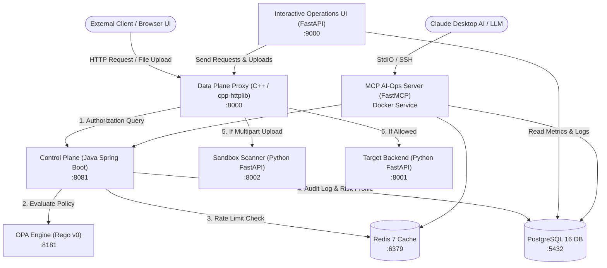

# Zero Trust Microservice Access Gateway

A production-grade, distributed **Zero Trust Access Gateway** architected across multiple languages and microservices. The gateway enforces continuous verification: **"Never Trust, Always Verify."**

No request reaches internal microservices without strict JWT validation, OPA dynamic policy evaluation, Redis sliding-window rate limiting, real-time risk-score threshold checks, and multipart sandbox file inspection.

---

## 🏗️ Architecture Overview



---

## 📦 Services & Technology Stack

| Service | Language / Stack | Port | Purpose |
|---|---|---|---|
| **Data Plane Proxy** | C++ (cpp-httplib, libcurl) | `8000` | High-throughput entry point; inspects headers, coordinates control-plane auth, streams file uploads |
| **Control Plane** | Java 17 (Spring Boot 3, Maven) | `8081` | Central authorization hub; coordinates OPA, Redis, PostgreSQL |
| **OPA (Open Policy Agent)** | Go / Rego v0 | `8181` | Policy decision point (PDP) enforcing RBAC, path policies, risk scores |
| **Sandbox Service** | Python 3.12 (FastAPI, uvicorn) | `8002` | Content-inspection quarantine engine checking for malicious strings/payloads |
| **Target Backend** | Python 3.12 (FastAPI, uvicorn) | `8001` | Gateway-unaware internal business service returning realistic data |
| **Interactive UI** | Python 3.12 (FastAPI, HTML/CSS) | `9000` | Human-crafted operations dashboard for live logs, statistics, and HTTP/file testing |
| **MCP Server** | Python 3.12 (FastMCP) | Internal | Model Context Protocol server exposing security telemetry & simulation tools to AI |
| **PostgreSQL** | Postgres 16 Alpine | `5432` | Persistent store for audit logs and user risk profiles |
| **Redis** | Redis 7 Alpine | `6379` | High-performance sliding-window rate limiting & risk cache |

---

## 🔒 Security Policies Enforced

1. **Authentication**: All requests must provide `Authorization: Bearer <token>`. Missing or non-Bearer headers are rejected with `403 Access Denied`.
2. **Role-Based Access Control (RBAC)**:
   - `admin`: Can access all endpoints (`/api/v1/admin/*`, `/api/v1/user/*`, `/api/v1/public/*`).
   - `user`: Restricted to `/api/v1/user/*` and `/api/v1/public/*`. Blocked on `/api/v1/admin/*`.
3. **Adaptive Risk Engine**: Every request carries an `X-Risk-Score`. Any score $\ge 50$ is blocked immediately regardless of role or authentication.
4. **Rate Limiting**: Redis sliding-window algorithm limits requests per user window.
5. **Zero Trust File Sandbox**: Uploaded files containing suspicious patterns (e.g. reverse shells, command execution keywords) are rejected with `422 Unprocessable Entity`.
6. **Immutable Audit Trail**: All decisions (`ALLOWED` or `DENIED`) and reasons are written to PostgreSQL.

---

## 🚀 Quick Start

### Prerequisites
- [Docker](https://www.docker.com/) & Docker Compose installed and running.

### 1. Clone & Start Containers
```powershell
# Navigate into the project directory
cd zero-trust-gateway

# Build and start all services in detached mode
docker compose up --build -d
```

### 2. Verify Container Health
```powershell
docker compose ps
```
All containers should show as `healthy` or `running`.

---

## 🖥️ Web Dashboard (`http://localhost:9000`)

Open your browser to **`http://localhost:9000`** to access the operations panel:

- **System Details & Logs Tab**:
  - Live statistics: Total Requests, Allowed Requests, Blocked/Denied, Denial Rate.
  - Interactive Audit Log table: Defaults to **last 30 entries** with a **"See More (Show All)"** button.
  - Real-time User Risk Profiles.
- **Test Gateway (Form & Upload) Tab**:
  - Send requests via custom HTTP methods (`GET`, `POST`, `PUT`, `DELETE`).
  - Pre-filled URL chips for rapid testing.
  - Edit headers: `Authorization`, `X-User-ID`, `X-Role`, `X-Risk-Score`.
  - **File Upload Picker**: Select any local file to send through the Gateway into the Sandbox Scanner.

---

## 🌐 Gateway Endpoints (`http://localhost:8000`)

All client requests must go through the Data Plane Proxy at port **`8000`**:

| Method | Endpoint | Required Role | Risk Score | Description |
|---|---|---|---|---|
| `GET` | `/api/v1/public/status` | `user` or `admin` | < 50 | Public service uptime & status |
| `GET` | `/api/v1/user/data` | `user` or `admin` | < 50 | Realistic randomized customer business records |
| `POST` | `/api/v1/user/upload` | `user` or `admin` | < 50 | Multipart file upload checked by Sandbox service |
| `GET` | `/api/v1/admin/metrics` | `admin` | < 50 | Cluster node health, latency, & telemetry |
| `GET` | `/api/v1/admin/audit-export` | `admin` | < 50 | Administrative compliance audit dump |

---

## 🧪 CLI Testing Examples

> **Note for Windows PowerShell**: Use `curl.exe` to avoid the PowerShell alias.

### 1. Successful User Request (`200 OK`)
```powershell
curl.exe -s http://localhost:8000/api/v1/user/data `
  -H "Authorization: Bearer my-token" `
  -H "X-User-ID: alice" `
  -H "X-Role: user" `
  -H "X-Risk-Score: 12"
```

### 2. Unauthorized Role Privilege Escalation (`403 Denied`)
```powershell
curl.exe -s http://localhost:8000/api/v1/admin/metrics `
  -H "Authorization: Bearer my-token" `
  -H "X-User-ID: bob" `
  -H "X-Role: user" `
  -H "X-Risk-Score: 20"
```

### 3. High Risk Block (`403 Denied`)
```powershell
curl.exe -s http://localhost:8000/api/v1/user/data `
  -H "Authorization: Bearer my-token" `
  -H "X-User-ID: charlie" `
  -H "X-Role: user" `
  -H "X-Risk-Score: 75"
```

### 4. Malicious File Upload Quarantine (`422 Rejected`)
```powershell
echo "eval(compile('import os; os.system(\"calc\")'))" > payload.py
curl.exe -s -X POST http://localhost:8000/api/v1/user/upload `
  -H "Authorization: Bearer my-token" `
  -H "X-User-ID: dave" `
  -H "X-Role: user" `
  -H "X-Risk-Score: 10" `
  -F "file=@payload.py"
```

---

## 🤖 Connecting MCP to Claude Desktop

The gateway includes an **AI Model Context Protocol (MCP)** server providing AI assistants with tools to analyze audit logs, query threat metrics, and simulate policy evaluations.

### Local Docker Setup
Add the following to `%APPDATA%\Claude\claude_desktop_config.json`:
```json
{
  "mcpServers": {
    "zt-gateway": {
      "command": "docker",
      "args": [
        "exec",
        "-i",
        "zero-trust-gateway-mcp-server-1",
        "python",
        "server.py"
      ]
    }
  }
}
```

### Cloud / Remote Docker Setup (via SSH)
If Docker is deployed on a remote cloud VM (AWS, GCP, DigitalOcean):
```json
{
  "mcpServers": {
    "zt-gateway-cloud": {
      "command": "ssh",
      "args": [
        "-i", "C:\\path\\to\\your-cloud-key.pem",
        "ubuntu@YOUR_CLOUD_SERVER_IP",
        "docker exec -i zero-trust-gateway-mcp-server-1 python server.py"
      ]
    }
  }
}
```

---

## 📁 Repository Directory Structure

```text
zero-trust-gateway/
├── control-plane/          # Spring Boot 3 Central Auth & Policy Coordinator
├── dashboard/              # Operations UI (HTML/CSS, Logs & Request Tester)
├── data-plane-proxy/       # High-performance C++ HTTP Gateway Proxy
├── mcp-server/             # Model Context Protocol Server for AI Ops
├── opa/                    # Open Policy Agent (Rego rules & Dockerfile)
├── sandbox-service/        # Python FastAPI Malicious File Scanner
├── target-backend/         # Microservice returning business data
├── init.sql                # PostgreSQL schemas, indexes & seed profiles
├── docker-compose.yml      # Orchestration across all 9 services
└── README.md
```

---

## 🛑 Stopping the System
```powershell
docker compose down
```
To also remove database volumes and reset all logs:
```powershell
docker compose down -v
```
